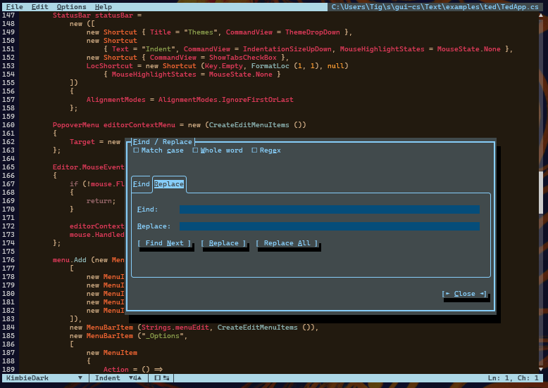

# Terminal.Gui.Editor



A full-featured text editor `View` for [Terminal.Gui](https://github.com/gui-cs/Terminal.Gui), built on a hard fork of [AvaloniaEdit](https://github.com/AvaloniaUI/AvaloniaEdit)'s pure-data layers (Document, Folding, Search, Indentation, Highlighting).

Ships as a single NuGet package: **`Terminal.Gui.Editor`**.

- **Document layer** (`Terminal.Gui.Document` namespace) — UI-framework-independent: rope-backed `TextDocument`, `TextAnchor`, `UndoStack`, `FoldingManager`, search, indentation, highlighting.
- **Editor view** (`Terminal.Gui.Views` namespace) — an `Editor : View` subclass consuming the document layer and rendering on a cell grid, with selection, multi-caret, folding, search, and (post-MVP) TextMate highlighting.

`Editor` ships alongside `TextView`. It is **not** a drop-in replacement and has no source-compat obligation to it.

## Status

Pre-alpha — see [`specs/00-plan.md`](specs/00-plan.md) for the full implementation plan, phased milestones, and open decisions.

## Repository layout

```
specs/        Planning and design docs
src/          Terminal.Gui.Editor library (document layer + Editor view)
tests/        xUnit.v3 test projects (correctness + perf smoke)
benchmarks/   BenchmarkDotNet suite + CI baseline
examples/     ted — standalone demo app
```

## Build

Requires the .NET 10 SDK (preview).

```sh
dotnet restore Terminal.Gui.Editor.slnx
dotnet build   Terminal.Gui.Editor.slnx

# Correctness suites — run on every push/PR across ubuntu/macos/windows.
dotnet run --project tests/Terminal.Gui.Editor.Tests
dotnet run --project tests/Terminal.Gui.Editor.IntegrationTests

# Perf smoke + BenchmarkDotNet baseline gate — ubuntu-latest only in CI
# (.github/workflows/perf.yml). Run locally in Release config.
dotnet run --project tests/Terminal.Gui.Editor.PerformanceTests -c Release
```

Run the demo:

```sh
dotnet run --project examples/ted
```

## License

MIT — see [`LICENSE`](LICENSE).

Portions of the document layer are adapted from [AvaloniaEdit](https://github.com/AvaloniaUI/AvaloniaEdit) (MIT). See [`third_party/AvaloniaEdit/UPSTREAM.md`](third_party/AvaloniaEdit/UPSTREAM.md) for the pinned upstream commit and per-file modification log.
